# Mermaid gallery

## Flowchart

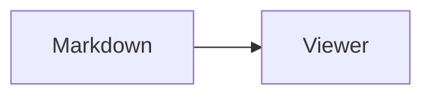

## Sequence

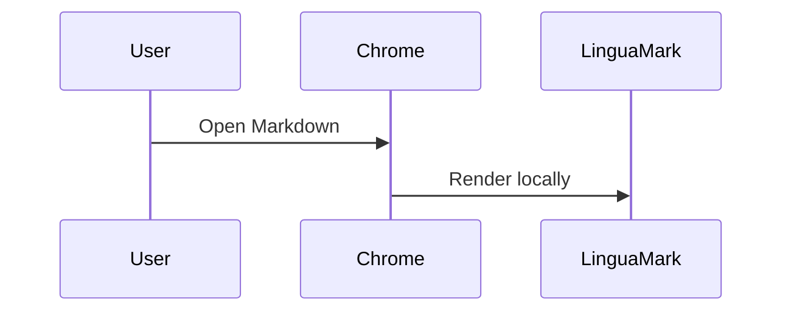

## Class

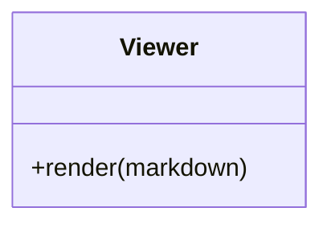

## Entity relationship

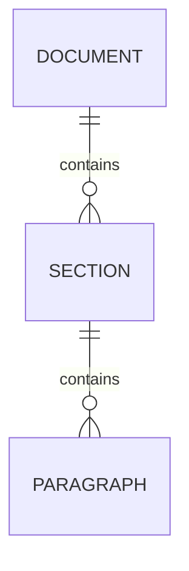

## State

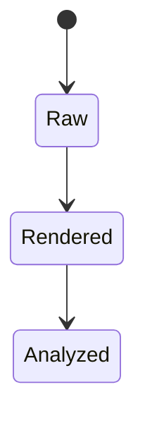

## Gantt

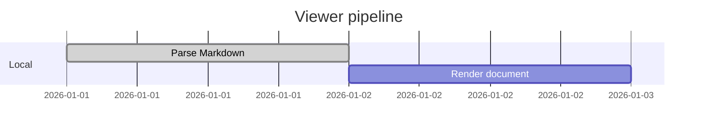

## Git graph

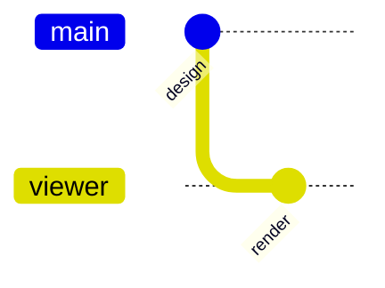

## Journey

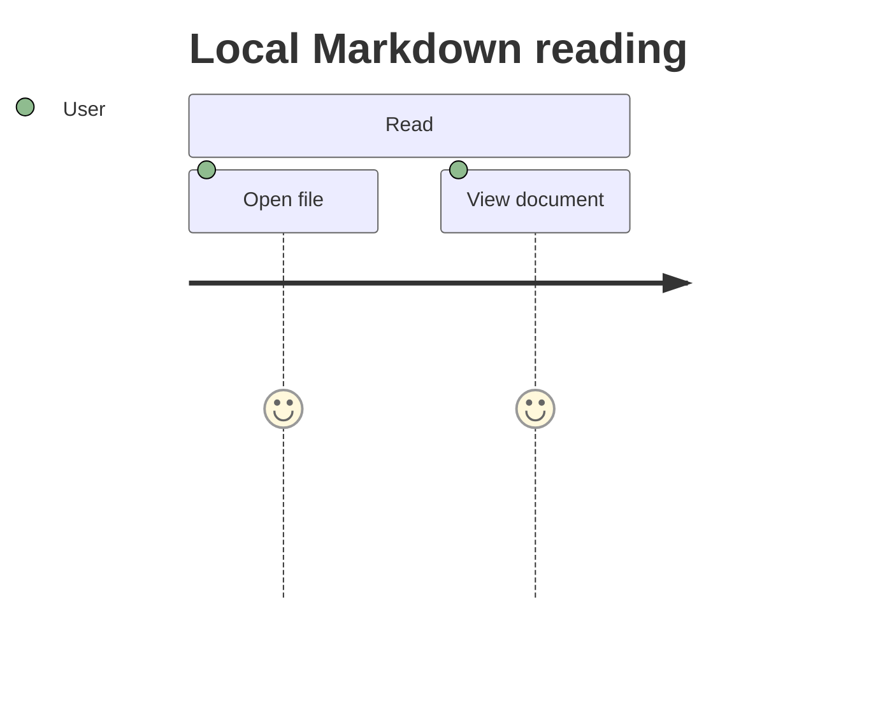

## Mindmap

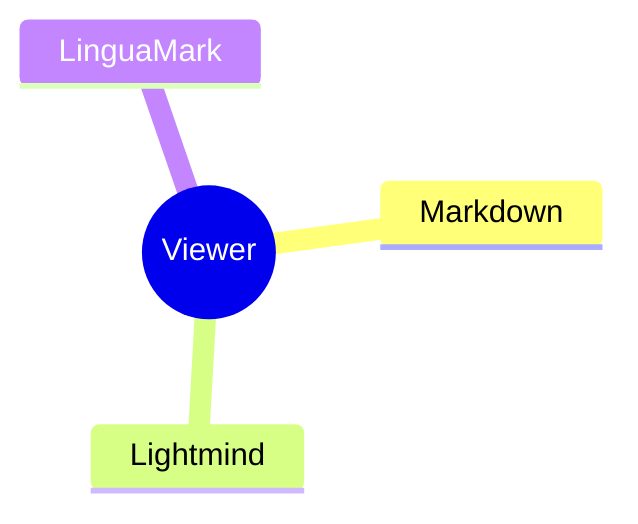

## Packet

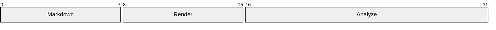

## XY chart

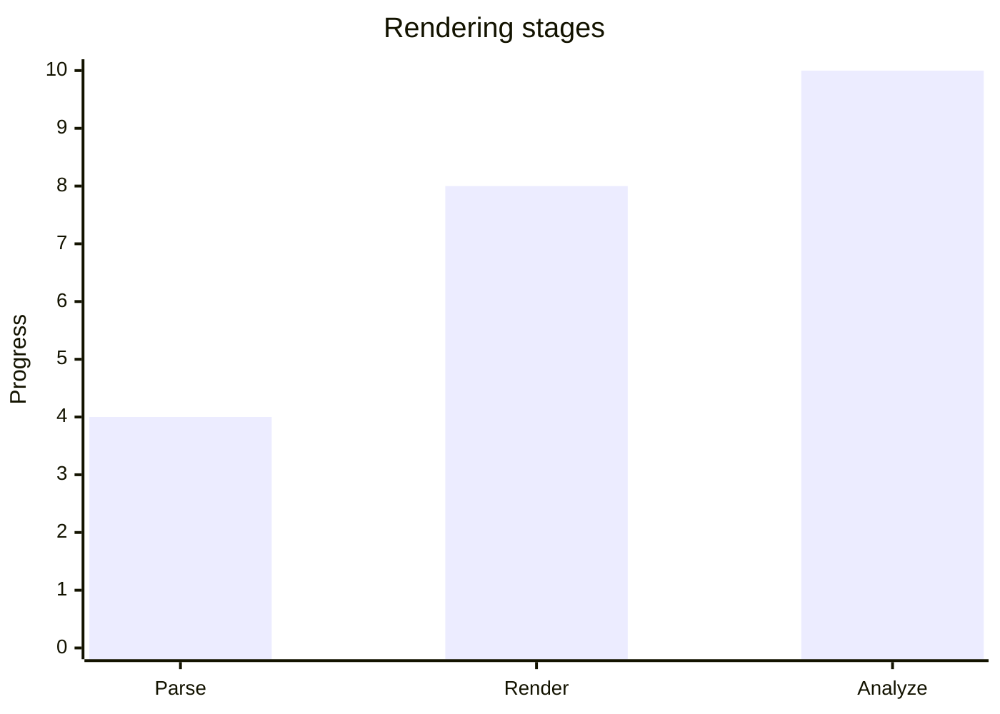

## Sankey

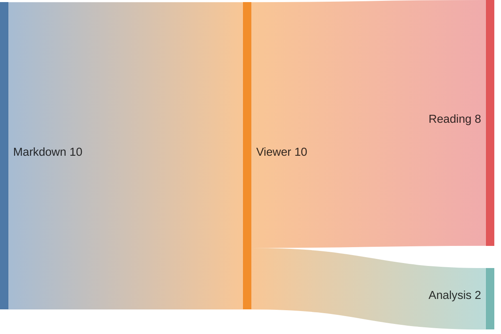

## Pie

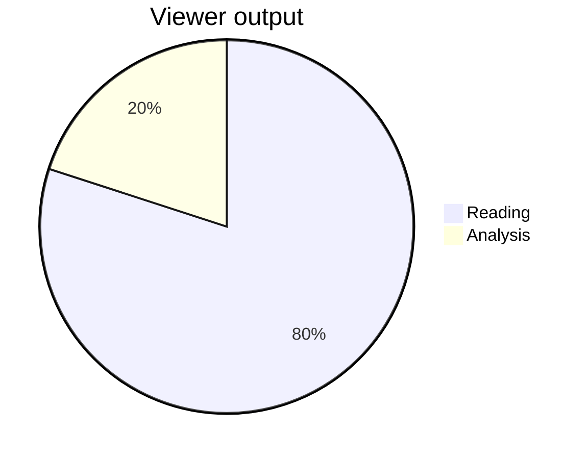

## ZenUML

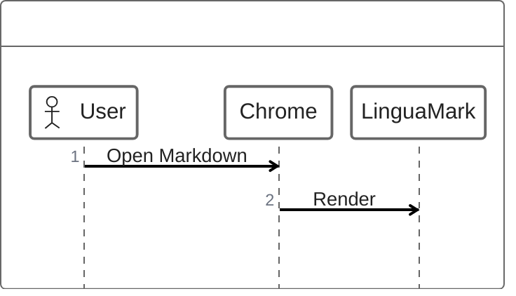
