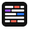
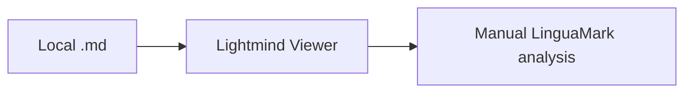
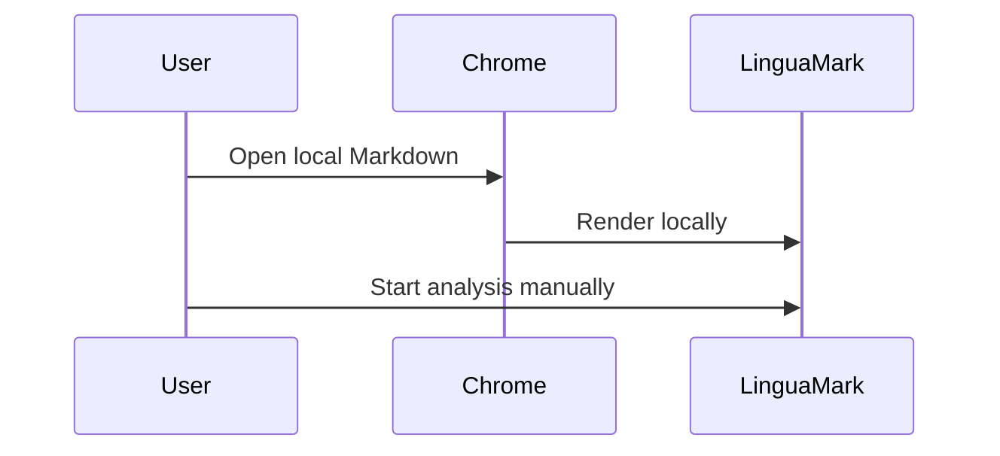

# LinguaMark Markdown Viewer

[TOC]

## Reading sample

Clear writing helps readers understand difficult ideas. **Important words** can be strong, *supporting phrases* can be italic, and [local links](../../README.md) should keep working.



> [!NOTE]
> This alert verifies the Lightmind note style.

> A normal quotation remains visually distinct from the surrounding article.

- [x] Render local Markdown
- [ ] Start LinguaMark analysis only after a user action
- Nested lists
  1. Preserve structure
  2. Preserve spacing

| Feature | Expected result |
| --- | --- |
| Table | Lightmind colors |
| Relative resource | Resolves from this file |

Inline code uses `const ready = true`, while fenced code stays outside model analysis:

```ts
const greeting = "Hello, Markdown";
console.log(greeting);
```

A footnote reference should link to its definition.[^viewer]

[^viewer]: Footnotes remain inside the local document.

## Mathematics

Euler's identity is $e^{i\pi} + 1 = 0$.

$$
\int_0^1 x^2\,dx = \frac{1}{3}
$$

## Mermaid





```mermaid
this is intentionally invalid mermaid
```

## Raw HTML and CSS

<style>
#raw-card {
  padding: 14px 18px;
  border: 1px solid #4a7c59;
  border-radius: 8px;
  background: #ecefe6;
}
.linguamark-learning-root { display: none !important; }
</style>

<div id="raw-card" onclick="document.body.dataset.unsafe = 'true'">
  Raw HTML keeps its visual style, but its event handler must not run.
</div>

<a id="unsafe-link" href="javascript:document.body.dataset.unsafeUrl='true'">Unsafe URL sample</a>

<script>document.body.dataset.unsafeScript = "true";</script>

<iframe title="Sandboxed example" src="about:blank"></iframe>
